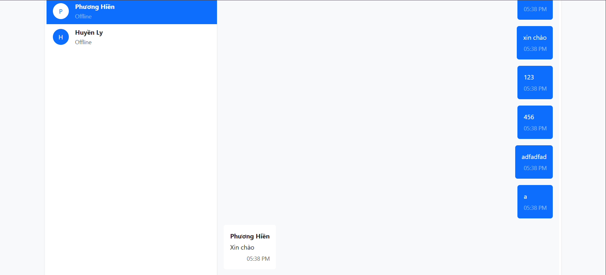

# Classroom-Management-App

Classroom Management App
Introduction

This is my submission for Coding Challenge #6.
It is a real-time Classroom Management App built with:

Frontend: React (Vite)

Backend: Node.js + Express

Database: Firebase

Real-time Messaging: Socket.io

Authentication: SMS/Email OTP (use Twilio for SMS)

The app provides role-based dashboards for Instructor and Student.

✨ Implemented Features

✅ Authentication with phone/email OTP
✅ Instructor: add/edit/delete students
✅ Instructor: assign lessons to students
✅ Student: view and mark lessons as done
✅ Real-time chat between instructor and student
✅ Firebase integration for data storage
✅ Console logs for tracking operations

📂 Project Structure
.
├── frontend/ # React frontend
│ ├── src/
│ │ ├── components/
│ │ ├── pages/
│ │ └── utils/
│ └── package.json
│
├── backend/ # Express backend
│ ├── routes/
│ ├── controllers/
│ ├── config/
│ └── server.js
│
├── firebase/ # Firebase configuration
└── README.md

⚙️ Installation & Run

1. Clone the repo

git clone https://github.com/trunghieu0716/Classroom-Management-App.git

2️. Setup frontend

cd frontend
npm install
npm run dev

3️. Setup backend

cd backend
npm install
npm run dev

4️. Setup Firebase

Create a Firebase project.

Add your firebaseConfig in server/config/firebase.js.

5️ Setup Twilio

TWILIO_SID=xxxx
TWILIO_AUTH_TOKEN=xxxx
TWILIO_PHONE=+123456789

6. Setup email OTP
   EMAIL_USER=your_email@gmail.com
   EMAIL_PASS=etwt xxx

📸 Screenshots
Role (Instructor and Student)

Sign in Instructor (use development OTP)

Instructor screen

Student screen

OTP email

Messages

